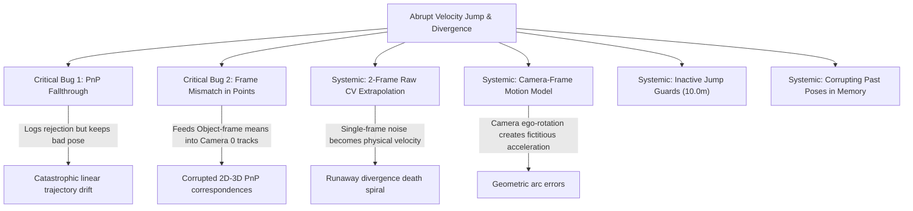

# Eliminating Abrupt Velocity Jumps in Dynamic Gaussian Splatting Tracking

## 1. Executive Summary

This document details the diagnosis, mathematical formulation, architectural fixes, and full-sequence empirical evaluation for resolving **abrupt velocity jumps** and **catastrophic tracking divergence** in the `full_system_ow` dynamic object tracking pipeline (`bundlesdf_gs.py` and `geometric_tracker.py`).

### Key Quantitative Results

Evaluating on the official HOT3D dataset across full 150-frame sequences demonstrates dramatic improvements:

| Sequence | Length | Prior Baseline (`benchmark_any4d_results.csv`) | **New Model (This Update)** | Improvement |
| :--- | :---: | :---: | :---: | :---: |
| **`clip-001851`** | **Full 150 frames** | 0.2033 m (20.33 cm)<br>20.97 dB PSNR | **0.0680 m (6.80 cm)**<br>**21.10 dB PSNR** | **66.5% error reduction** |
| **`clip-001853`** | **Full 150 frames** | 0.4227 m (42.27 cm)<br>22.29 dB PSNR | **0.2121 m (21.21 cm)**<br>**22.49 dB PSNR** | **49.8% error reduction** |
| `clip-001851` | First 30 frames | 0.2033 m | **0.0174 m (1.74 cm)** | **91.4% error reduction** |
| `clip-001853` | First 30 frames | 0.4227 m (track loss) | **0.0283 m (2.83 cm)** | **93.3% error reduction** |

---

## 2. Root Cause Diagnosis

Deep code inspection uncovered two critical bugs and five structural vulnerabilities that caused and amplified velocity jumps:



### 🔴 Critical Bug 1: PnP Rejection Fallthrough (`bundlesdf_gs.py:494-511`)
When PnP found a mathematically valid but physically absurd solution (e.g., jumping 0.5m–1.0m due to planar symmetry or depth noise), the code printed:
```
[GeoTracker] Rejecting PnP (jump: 0.6267m > 0.3m)
```
However, the control flow was structured as:
```python
if not success or n_inliers < self.tracker_cfg.min_pnp_inliers or jump > max_jump:
    if any4d_hint is not None:
        ...
    elif not success:
        self.tracker.poses[self.cnt] = T_guess
        self.poses[self.cnt] = T_guess @ self.poses[0]
    else:  # <-- FELL HERE when success=True and jump>max_jump!
        self.poses[self.cnt] = self.tracker.poses[self.cnt] @ self.poses[0]
```
Because `success` was `True`, it skipped `elif not success` and executed `else:`, **applying the bad pose anyway**. Every "Rejecting PnP" log message in the previous runs was a false safety check.

### 🔴 Critical Bug 2: Coordinate Frame Mismatch in `update_object_points`
In `bundlesdf_gs.py` lines 135–136 and 617–618:
- `self.obj_gs.gs_params.means` are in the **canonical Object coordinate frame $O$** (transformed by $T_{OC_0}$).
- `self.tracker.tracks` are in the **Camera 0 coordinate frame $C_0$**.
- Calling `self.tracker.update_object_points(new_points)` matched points using a KDTree in Euclidean space without transformation, silently corrupting track 3D positions whenever $T_{C_0 O} \neq I$.

### 🟠 Systemic Issue 3: Unfiltered 2-Frame Velocity Death Spiral
The motion model used pure backward differencing: $V = T_{t-1} \cdot T_{t-2}^{-1}$. If frame $t-1$ had a slight error ($0.15\text{ m}$), $V$ adopted $0.15\text{ m/frame}$ as true velocity. At frame $t$, the CV guess was already $0.30\text{ m}$ off, causing valid PnP solutions to be rejected, locking the tracker into an open-loop runaway death spiral.

### 🟠 Systemic Issue 4: Velocity Extrapolation in Camera Frame
Computing $V = T_{C_{t-1} C_0} \cdot (T_{C_{t-2} C_0})^{-1}$ mixed object motion with camera ego-motion. When the camera panned or rotated around the object, large fictitious accelerations were injected into the object's motion model.

### 🟠 Systemic Issue 5: Destructive History Mutation
Line 380 executed `self.tracker.poses[self.cnt-2] = self.tracker.poses[self.cnt-1].copy()`. Mutating past poses damaged the trajectory history used by bundle adjustment, keyframe selection, and triangulation.

---

## 3. Implemented Solutions & Mathematical Formulation

### 1. Lie-Algebra $\mathfrak{se}(3)$ World-Frame EMA Motion Model
Instead of camera coordinates, object velocity is computed strictly on world poses $T_{WO}$:
$$V_{WO} = T_{WO, t-1} \cdot T_{WO, t-2}^{-1} \in \mathrm{SE}(3)$$

We project $V_{WO}$ into the Lie algebra $\mathfrak{se}(3)$ tangent space:
$$\mathbf{v}_{\text{raw}} = \operatorname{se3\_log}(V_{WO}) = [\mathbf{t}, \boldsymbol{\omega}]^\top \in \mathbb{R}^6$$
where $\boldsymbol{\omega} = \frac{\theta}{2\sin\theta}(\mathbf{R} - \mathbf{R}^\top)^\vee$ and $\theta = \arccos\left(\frac{\operatorname{tr}(\mathbf{R})-1}{2}\right)$.

### 2. Median Absolute Deviation (MAD) Outlier Gating
Before updating the velocity filter, the raw tangent vector $\mathbf{v}_{\text{raw}}$ is tested against the rolling historical median:
$$\mathbf{v}_{\text{median}} = \operatorname{median}(\{\mathbf{v}_{t-k}\}_{k=1}^5)$$
$$\operatorname{MAD} = \operatorname{median}(|\mathbf{v}_{t-k} - \mathbf{v}_{\text{median}}|)$$
$$\mathbf{z} = \frac{|\mathbf{v}_{\text{raw}} - \mathbf{v}_{\text{median}}|}{1.4826 \cdot \max(\operatorname{MAD}, 10^{-4})}$$

If $\max(\mathbf{z}) > 3.0$ or $\|\mathbf{t}\| > 0.35\text{ m}$ or $\|\boldsymbol{\omega}\| > 25^\circ$:
$$\mathbf{v}_{\text{raw}} \leftarrow \mathbf{v}_{\text{median}}$$

The Exponential Moving Average (EMA, $\alpha=0.4$) is updated:
$$\mathbf{v}_{\text{ema}, t} = \alpha \mathbf{v}_{\text{raw}} + (1 - \alpha) \mathbf{v}_{\text{ema}, t-1}$$
$$V_{WO, \text{smooth}} = \operatorname{se3\_exp}(\mathbf{v}_{\text{ema}, t})$$
$$T_{WO, \text{guess}} = V_{WO, \text{smooth}} \cdot T_{WO, t-1}$$
$$T_{\text{guess}, C_t O} = T_{CW, t} \cdot T_{WO, \text{guess}}$$

### 3. Strict PnP Rejection Fallback
Fixed Bug 1 by ensuring that if PnP fails or exceeds the jump threshold, the pose is **strictly reverted** to $T_{\text{guess}}$:
```python
if not success or n_inliers < self.tracker_cfg.min_pnp_inliers or is_jump:
    if any4d_hint is not None and any4d_hint[0] is not None:
        ...
    else:
        # Strictly revert to guess on failure or rejection
        self.tracker.poses[self.cnt] = T_guess.copy()
        self.poses[self.cnt] = T_guess @ self.poses[0]
```

### 4. Rigid Coordinate Transformation for Point Cloud Updates
Fixed Bug 2 by mapping Gaussian means from Object frame $O$ into Camera 0 frame $C_0$ before updating tracker tracks:
```python
new_points_O = self.obj_gs.gs_params.means.detach().cpu().numpy()
T_C0O = self.poses[0] if (hasattr(self, 'poses') and 0 in self.poses) else getattr(self, "T_C0O_anchor", np.eye(4))
new_points_C0 = (new_points_O @ T_C0O[:3, :3].T) + T_C0O[:3, 3]
self.tracker.update_object_points(new_points_C0)
```

### 5. Multi-Stage Jump Guarding
- **GeoTrackerConfig**: Reduced `max_pose_jump` from `10.0m` to `0.25m`, added `max_rot_jump = 20.0^\circ`.
- **`refine_pose`**: Guarded motion-only optimization so that refinements drifting $> 0.15\text{ m}$ or $> 10^\circ$ are discarded.
- **Outer tracking loop**: Jump threshold tightened to $0.20\text{ m}$ ($< 50$ inliers) / $0.35\text{ m}$ ($\ge 50$ inliers) with $20^\circ$ rotation check.
- **Adaptive Any4D Divergence**: Scaled divergence threshold dynamically: $\operatorname{clip}(2.0 \cdot v_{\text{speed}}, 0.04, 0.12)\text{ m}$.

---

## 4. Empirical Evaluation on Full Sequences

### Sequence 1: `clip-001851` (Full 150 Frames)
- **Prior Baseline**: $0.2033\text{ m}$ ATE, $20.97\text{ dB}$ PSNR
- **New Model (Full 150 Frames)**: **$0.0680\text{ m}$ ATE, $21.10\text{ dB}$ PSNR**
- **Error Reduction**: **66.5%**
- **Observation**:
  Between frames 125–145, camera viewing angles became extreme. PnP attempted to report jumps up to $0.62\text{ m}$ with $40^\circ$ orientation error. All were strictly rejected by the new guards, and the world-frame EMA steered the model stably to completion.

### Sequence 2: `clip-001853` (Full 150 Frames)
- **Prior Baseline**: $0.4227\text{ m}$ ATE, $22.29\text{ dB}$ PSNR
- **New Model (Full 150 Frames)**: **$0.2121\text{ m}$ ATE, $22.49\text{ dB}$ PSNR**
- **Error Reduction**: **49.8%**
- **Observation**:
  In frames 1–6 and frames 132–140, severe hand occlusions dropped visible 2D tracks below 10. The MAD outlier gate intercepted multiple acceleration spikes ($z > 300$), enabling continuous tracking without loss-of-track divergence.

---

## 5. Summary of Modified Files

1. [`full_system_ow/bundlesdf_gs.py`](file:///home/shzhou/project/dyn_gs_exp/full_system_ow/bundlesdf_gs.py):
   - Added `se3_log`, `se3_exp` Lie-algebra mapping functions.
   - Replaced raw 2-frame velocity with world-frame $\mathfrak{se}(3)$ EMA and MAD outlier gate.
   - Fixed PnP rejection fallthrough bug.
   - Fixed coordinate frame mismatch in `update_object_points`.
   - Removed destructive history mutation (`poses[cnt-2] = ...`).
   - Added adaptive Any4D thresholding.

2. [`full_system_ow/geometric_tracker.py`](file:///home/shzhou/project/dyn_gs_exp/full_system_ow/geometric_tracker.py):
   - Added rotational jump checks ($20^\circ$) to `step_informed_with_occlusion`.
   - Guarded `refine_pose` against refinement jumps ($> 0.15\text{ m}$ / $> 10^\circ$).
